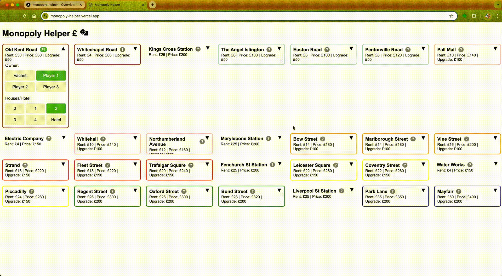

# Monopoly Helper

Monopoly Helper is a tool to be used when playing the board game Monopoly. It helps you to keep track of the game state by recording the properties owned by each player, and it will calculate the rent based on the properties owned by each player. For example, if a player owns all the properties of a color group, the rent will be doubled. And if there are upgrades to the properties, the rent will be adjusted accordingly.

There is also a virtual dice roller in case you can't find the dice or you don't want the dice to roll under the table.

Here's a demo of usage:

The tiles will automatically collapse after use to save space and be ready for the next round. The web app is responsive, so it should work on a mobile screen as well as tablet or desktop.

# Hosting

The app is hosted on at https://monopoly-helper.vercel.app/
